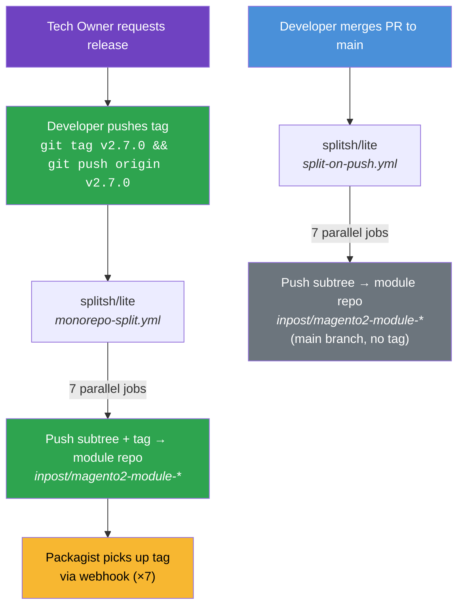
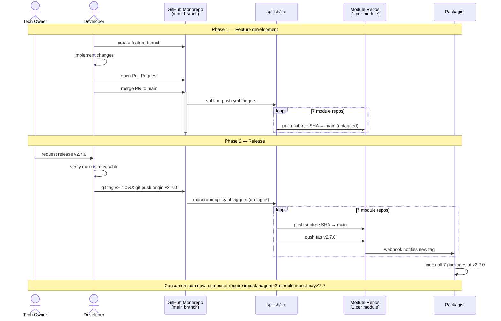

# Releasing

## Overview

All 7 packages share the same version, set manually by the tech owner via git tag. There is no auto-versioning — the tag is the single source of truth.



## Release Lifecycle (Sequence)



## How Versioning Works

- All packages share the **same version** — a single tag (e.g., `v2.7.0`) releases all 7 packages at once.
- The **git tag is the source of truth**. There is no `version` field in `composer.json` — Packagist reads the tag directly.
- Tags follow [SemVer](https://semver.org/) with a `v` prefix: `v{major}.{minor}.{patch}` (e.g., `v2.7.0`).
- Version bumps are decided by the tech owner and tagged by a developer.

## Performing a Release

1. Tech owner requests a release and provides the version number.
2. Developer ensures `main` is in a releasable state — all CI checks pass, features are complete.
3. Create and push the tag:
   ```bash
   git tag v2.7.0
   git push origin v2.7.0
   ```
4. The `monorepo-split.yml` workflow triggers automatically:
   - Splits each package subtree via splitsh/lite
   - Pushes the subtree + tag `v2.7.0` to all 7 split repos under `inpost/`
5. Packagist picks up the new tags via webhooks — no manual action needed.

## Monorepo Split (splitsh/lite)

The split process uses [splitsh/lite](https://github.com/splitsh/lite), the industry-standard subtree splitting tool by Fabien Potencier (used by Symfony for 50+ packages).

Two workflows handle splitting:
- **`split-on-push.yml`** — runs on every push to `main`, syncs the latest code to split repos (untagged)
- **`monorepo-split.yml`** — runs on tag push (`v*`), pushes subtrees + the tag to all split repos

The split org is `inpost` — each package maps to `inpost/magento2-module-*`.

## Troubleshooting

### Tag not triggering the workflow
- Ensure the tag starts with `v` (e.g., `v2.7.0`, not `2.7.0`)
- Ensure you pushed the tag: `git push origin v2.7.0`
- Check the Actions tab for the "Monorepo Split" workflow run

### Split failed
- Verify `SPLIT_REPO_ACCESS_TOKEN` secret is set and has `repo` scope
- Verify the target repo exists under the `inpost` org (e.g., `inpost/magento2-module-inpost-pay`)
- Check the split workflow logs for `splitsh-lite` output

### Packagist not updating
- Verify the webhook is configured on the split repo (Settings → Webhooks)
- Check Packagist dashboard for the package — look for webhook delivery errors
- Manually trigger an update on Packagist if needed

## Secrets Reference

| Secret | Purpose | Scope |
|---|---|---|
| `SPLIT_REPO_ACCESS_TOKEN` | PAT for pushing to split repos | `repo` scope, access to `inpost` org |
| `COMPOSER_AUTH` | Composer authentication for CI (private packages) | CI only |
| `HYVA_AUTH` | Hyva Composer repository credentials | CI only |

## Demo / Training Environment

A `fwc-demo` org can be used for testing the full release cycle without affecting production repos. See `scripts/setup-demo-org.sh` for automated setup.

To run a test release cycle:
1. Run the setup script to create demo split repos
2. Fork the monorepo to your account / the demo org
3. Update `inpost` → `fwc-demo` in the workflow files
4. Set `SPLIT_REPO_ACCESS_TOKEN` secret on the fork
5. Push a commit to main, then tag it:
   ```bash
   git commit --allow-empty -m 'test release cycle'
   git push origin main
   git tag v0.0.1-test
   git push origin v0.0.1-test
   ```
